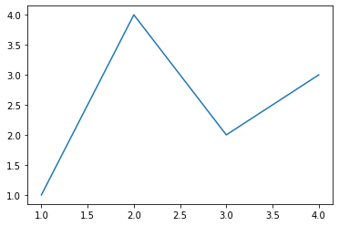
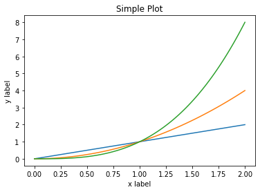
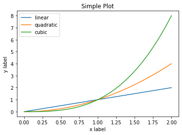

# 第一回：Matplotlib初相识

## 一、认识matplotlib

Matplotlib是一个Python 2D绘图库，能够以多种硬拷贝格式和跨平台的交互式环境生成出版物质量的图形，用来绘制各种静态，动态，交互式的图表。

Matplotlib可用于Python脚本，Python和IPython Shell、Jupyter notebook，Web应用程序服务器和各种图形用户界面工具包等。

Matplotlib是Python数据可视化库中的泰斗，它已经成为python中公认的数据可视化工具，我们所熟知的pandas和seaborn的绘图接口其实也是基于matplotlib所作的高级封装。

为了对matplotlib有更好的理解，让我们从一些最基本的概念开始认识它，再逐渐过渡到一些高级技巧中。

## 二、一个最简单的绘图例子

Matplotlib的图像是画在figure（如windows，jupyter窗体）上的，每一个figure又包含了一个或多个axes（一个可以指定坐标系的子区域）。最简单的创建figure以及axes的方式是通过`pyplot.subplots`命令，创建axes以后，可以使用`Axes.plot`绘制最简易的折线图。


```python
import matplotlib.pyplot as plt
import numpy as np
```


```python
fig, ax = plt.subplots()  # 创建一个包含一个axes的figure
ax.plot([1, 2, 3, 4], [1, 4, 2, 3])  # 绘制图像
```


    [<matplotlib.lines.Line2D at 0x29936f8d588>]





和MATLAB命令类似，你还可以通过一种更简单的方式绘制图像，`matplotlib.pyplot`方法能够直接在当前axes上绘制图像，如果用户未指定axes，matplotlib会帮你自动创建一个。所以上面的例子也可以简化为以下这一行代码。


```python
plt.plot([1, 2, 3, 4], [1, 4, 2, 3])  
```


    [<matplotlib.lines.Line2D at 0x23c305b8160>]


## 三、Figure的组成

现在我们来深入看一下figure的组成。通过一张figure解剖图，我们可以看到一个完整的matplotlib图像通常会包括以下四个层级，这些层级也被称为容器（container），下一节会详细介绍。在matplotlib的世界中，我们将通过各种命令方法来操纵图像中的每一个部分，从而达到数据可视化的最终效果，一副完整的图像实际上是各类子元素的集合。

- `Figure`：顶层级，用来容纳所有绘图元素 

- `Axes`：matplotlib宇宙的核心，容纳了大量元素用来构造一幅幅子图，一个figure可以由一个或多个子图组成

- `Axis`：axes的下属层级，用于处理所有和坐标轴，网格有关的元素

- `Tick`：axis的下属层级，用来处理所有和刻度有关的元素

  

## 四、两种绘图接口

matplotlib提供了两种最常用的绘图接口

1. 显式创建figure和axes，在上面调用绘图方法，也被称为OO模式（object-oriented style)

2. 依赖pyplot自动创建figure和axes，并绘图

使用第一种绘图接口，是这样的：


```python
x = np.linspace(0, 2, 100)

fig, ax = plt.subplots()  
ax.plot(x, x, label='linear')  
ax.plot(x, x**2, label='quadratic')  
ax.plot(x, x**3, label='cubic')  
ax.set_xlabel('x label') 
ax.set_ylabel('y label') 
ax.set_title("Simple Plot")  
# ax.legend() 
```


    Text(0.5, 1.0, 'Simple Plot')





而如果采用第二种绘图接口，绘制同样的图，代码是这样的：


```python
x = np.linspace(0, 2, 100)

plt.plot(x, x, label='linear') 
plt.plot(x, x**2, label='quadratic')  
plt.plot(x, x**3, label='cubic')
plt.xlabel('x label')
plt.ylabel('y label')
plt.title("Simple Plot")
plt.legend()
```


    <matplotlib.legend.Legend at 0x29937137e48>





    OO模式 vs pyplot模式（参考论坛）
    
    OO模式：1.非交互式绘图  2.多个子图一起展示
    pyplot模式：1.交互式绘图   2.无多个子图

## 参考资料

[1.matplotlib官网用户指南](https://matplotlib.org/tutorials/introductory/usage.html#sphx-glr-tutorials-introductory-usage-py)

## 作业
你在工作或学习中通常何时会用到数据可视化，希望通过可视化达到什么目的？

    使用场景：
    
    1.进行探索性分析时，通过可视化可以更直观地发现数据特点
    2.向他人展示分析结果时，使用可视化的数据能够更直观地传达信息

    愿景：
    希望通过可视化使看起来有些乱的数字或文字变得更简洁直观


```python

```
