# 第三回：布局格式定方圆


```python
import numpy as np
import pandas as pd
import matplotlib.pyplot as plt
plt.rcParams['font.sans-serif'] = ['SimHei']
plt.rcParams['axes.unicode_minus'] = False
```

## 一、子图

### 1. 使用 `plt.subplots` 绘制均匀状态下的子图

返回元素分别是画布和子图构成的列表，第一个数字为行，第二个为列

`figsize` 参数可以指定整个画布的大小

`sharex` 和 `sharey` 分别表示是否共享横轴和纵轴刻度

`tight_layout` 函数可以调整子图的相对大小使字符不会重叠


```python
fig, axs = plt.subplots(2, 5, figsize=(10, 4), sharex=True, sharey=True)
fig.suptitle('样例1', size=20)
for i in range(2):
    for j in range(5):
        axs[i][j].scatter(np.random.randn(10), np.random.randn(10))
        axs[i][j].set_title('第%d行，第%d列'%(i+1,j+1))
        axs[i][j].set_xlim(-5,5)
        axs[i][j].set_ylim(-5,5)
        if i==1: axs[i][j].set_xlabel('横坐标')
        if j==0: axs[i][j].set_ylabel('纵坐标')
fig.tight_layout()
```


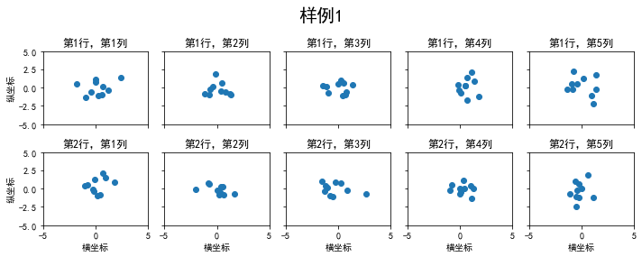


除了常规的直角坐标系，也可以通过`projection`方法创建极坐标系下的图表


```python
N = 150
r = 2 * np.random.rand(N)
theta = 2 * np.pi * np.random.rand(N)
area = 200 * r**2
colors = theta


plt.subplot(projection='polar')
plt.scatter(theta, r, c=colors, s=area, cmap='hsv', alpha=0.75)
```


    <matplotlib.collections.PathCollection at 0x231f1b0cb38>


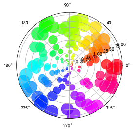


### 2. 使用 `GridSpec` 绘制非均匀子图

所谓非均匀包含两层含义，第一是指图的比例大小不同但没有跨行或跨列，第二是指图为跨列或跨行状态

利用 `add_gridspec` 可以指定相对宽度比例 `width_ratios` 和相对高度比例参数 `height_ratios`


```python
fig = plt.figure(figsize=(10, 4))
spec = fig.add_gridspec(nrows=2, ncols=5, width_ratios=[1,2,3,4,5], height_ratios=[1,3])
fig.suptitle('样例2', size=20)
for i in range(2):
    for j in range(5):
        ax = fig.add_subplot(spec[i, j])
        ax.scatter(np.random.randn(10), np.random.randn(10))
        ax.set_title('第%d行，第%d列'%(i+1,j+1))
        if i==1: ax.set_xlabel('横坐标')
        if j==0: ax.set_ylabel('纵坐标')
fig.tight_layout()
```


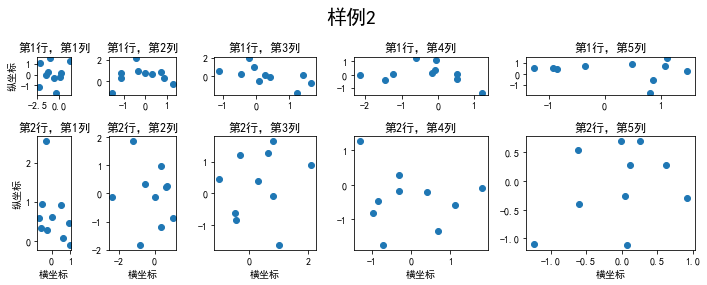


在上面的例子中出现了 `spec[i, j]` 的用法，事实上通过切片就可以实现子图的合并而达到跨图的共能


```python
fig = plt.figure(figsize=(10, 4))
spec = fig.add_gridspec(nrows=2, ncols=6, width_ratios=[2,2.5,3,1,1.5,2], height_ratios=[1,2])
fig.suptitle('样例3', size=20)
# sub1
ax = fig.add_subplot(spec[0, :3])
ax.scatter(np.random.randn(10), np.random.randn(10))
# sub2
ax = fig.add_subplot(spec[0, 3:5])
ax.scatter(np.random.randn(10), np.random.randn(10))
# sub3
ax = fig.add_subplot(spec[:, 5])
ax.scatter(np.random.randn(10), np.random.randn(10))
# sub4
ax = fig.add_subplot(spec[1, 0])
ax.scatter(np.random.randn(10), np.random.randn(10))
# sub5
ax = fig.add_subplot(spec[1, 1:5])
ax.scatter(np.random.randn(10), np.random.randn(10))
fig.tight_layout()
```


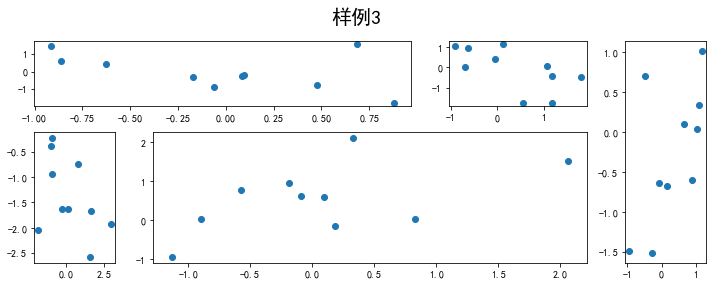


## 二、子图上的方法

在 `ax` 对象上定义了和 `plt` 类似的图形绘制函数，常用的有： `plot, hist, scatter, bar, barh, pie`


```python
fig, ax = plt.subplots(figsize=(4,3))
ax.plot([1,2],[2,1])
```


    [<matplotlib.lines.Line2D at 0x231f302ed68>]


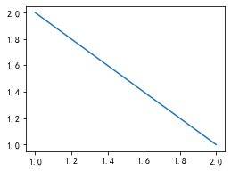


```python
fig, ax = plt.subplots(figsize=(4,3))
ax.hist(np.random.randn(1000))
```


    (array([  2.,   8.,  44., 113., 208., 256., 202., 123.,  37.,   7.]),
     array([-3.6700998 , -3.00030674, -2.33051368, -1.66072062, -0.99092756,
            -0.3211345 ,  0.34865856,  1.01845162,  1.68824468,  2.35803774,
             3.0278308 ]),
     <BarContainer object of 10 artists>)


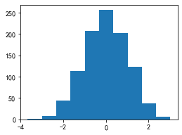


常用直线的画法为： `axhline, axvline, axline` （水平、垂直、任意方向）


```python
fig, ax = plt.subplots(figsize=(4,3))
ax.axhline(0.5,0.2,0.8)# Axes.axhline(self, y=0, xmin=0, xmax=1, **kwargs)
ax.axvline(0.5,0.2,0.8)# Axes.axvline(self, x=0, ymin=0, ymax=1, **kwargs)[source]
ax.axline([0.3,0.3],[0.7,0.7])
```


    <matplotlib.lines._AxLine at 0x231f1bcf7f0>


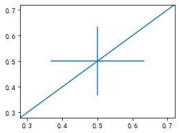


使用 `grid` 可以加灰色网格


```python
fig, ax = plt.subplots(figsize=(4,3))
ax.grid(True)
```


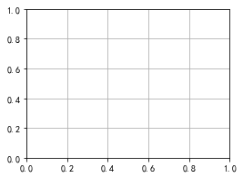


使用 `set_xscale, set_title, set_xlabel` 分别可以设置坐标轴的规度（指对数坐标等）、标题、轴名


```python
fig, axs = plt.subplots(1, 2, figsize=(10, 4))
fig.suptitle('大标题', size=20)
for j in range(2):
    axs[j].plot(list('abcd'), [10**i for i in range(4)])
    if j==0:
        axs[j].set_yscale('log')
        axs[j].set_title('子标题1')
        axs[j].set_ylabel('对数坐标')
    else:
        axs[j].set_title('子标题1')
        axs[j].set_ylabel('普通坐标')
fig.tight_layout()
```


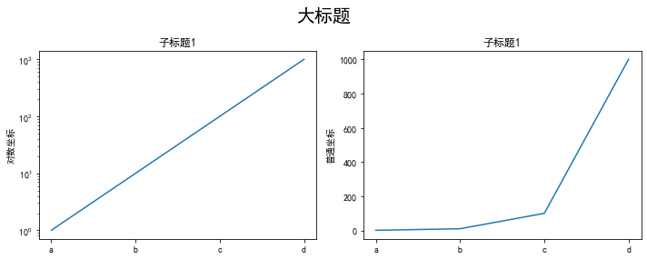


与一般的 `plt` 方法类似， `legend, annotate, arrow, text` 对象也可以进行相应的绘制


```python
fig, ax = plt.subplots()
# Axes.arrow(self, x, y, dx, dy, **kwargs)
# This draws an arrow from (x, y) to (x+dx, y+dy).
ax.arrow(0, 0, 1, 1, head_width=0.03, head_length=0.05, facecolor='red', edgecolor='blue')

ax.text(x=0, y=0,s='这是一段文字', fontsize=16, rotation=70, rotation_mode='anchor', color='green')

# Axes.annotate(self, text, xy, *args, **kwargs)
# xy:The point (x, y) to annotate
# xytext:The position (x, y) to place the text at
ax.annotate('这是中点', xy=(0.5, 0.5), xytext=(0.8, 0.2), arrowprops=dict(facecolor='yellow', edgecolor='black'), fontsize=16)
```


    Text(0.8, 0.2, '这是中点')


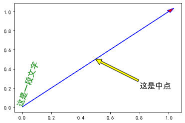


```python
fig, ax = plt.subplots()
ax.plot([1,2],[2,1],label="line1")
ax.plot([1,1],[1,2],label="line1")

# loc 1 -> upper right
ax.legend(loc=1)
```


    <matplotlib.legend.Legend at 0x231f1969400>


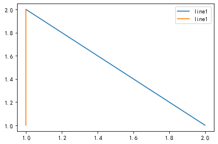


其中，图例的 `loc` 参数如下：

|  string   | code  |
|  ----  | ----  |
| best  | 0 |
| upper right  | 1 |
| upper left  | 2 |
| lower left  | 3 |
| lower right  | 4 |
| right  | 5 |
| center left  | 6 |
| center right  | 7 |
| lower center  | 8 |
| upper center  | 9 |
| center  | 10 |

## 作业

### 1. 墨尔本1981年至1990年的每月温度情况


```python
ex1 = pd.read_csv('data/layout_ex1.csv')
ex1.head()
```


<div>
<style scoped>
    .dataframe tbody tr th:only-of-type {
        vertical-align: middle;
    }

    .dataframe tbody tr th {
        vertical-align: top;
    }

    .dataframe thead th {
        text-align: right;
    }
</style>
<table border="1" class="dataframe">
  <thead>
    <tr style="text-align: right;">
      <th></th>
      <th>Time</th>
      <th>Temperature</th>
    </tr>
  </thead>
  <tbody>
    <tr>
      <th>0</th>
      <td>1981-01</td>
      <td>17.712903</td>
    </tr>
    <tr>
      <th>1</th>
      <td>1981-02</td>
      <td>17.678571</td>
    </tr>
    <tr>
      <th>2</th>
      <td>1981-03</td>
      <td>13.500000</td>
    </tr>
    <tr>
      <th>3</th>
      <td>1981-04</td>
      <td>12.356667</td>
    </tr>
    <tr>
      <th>4</th>
      <td>1981-05</td>
      <td>9.490323</td>
    </tr>
  </tbody>
</table>
</div>


- 请利用数据，画出如下的图：


```python
ex1['year'] = pd.to_datetime(ex1['Time']).dt.year
ex1['month'] = pd.to_datetime(ex1['Time']).dt.month
```


```python
from matplotlib.pyplot import MultipleLocator
fig, axs = plt.subplots(2, 5, figsize = (20, 5))
fig.suptitle('墨尔本1981年到1990年月温度曲线', size = 20)
for i in range(2):
    for j in range(5):
        axs[i][j].set_title('%d年'%(i*5+j+1981))
        data = ex1[ex1['year'] == i*5+j+1981]
        axs[i][j].plot(data['month'], data['Temperature'], '-',marker = '*')
        x_major_locator=MultipleLocator(1)
        axs[i][j].xaxis.set_major_locator(x_major_locator)
        y_major_locator=MultipleLocator(5)
        axs[i][j].yaxis.set_major_locator(y_major_locator)
        
        axs[i][j].set_ylim(4, 19)
        
        if i == 0:
            plt.setp(axs[i][j].get_xticklabels(), visible = False)
        if j == 0:
            axs[i][j].set_ylabel('气温')
        else:
            plt.setp(axs[i][j].get_yticklabels(), visible = False)
fig.tight_layout()
```


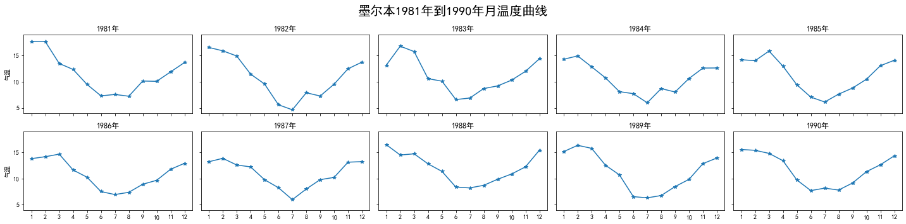


### 2. 画出数据的散点图和边际分布

- 用 `np.random.randn(2, 150)` 生成一组二维数据，使用两种非均匀子图的分割方法，做出该数据对应的散点图和边际分布图


```python
df = np.random.randn(2, 150)
```

法1：没有跨行或跨列


```python
fig = plt.figure(figsize=(6,6))
spec = fig.add_gridspec(nrows = 2, ncols = 2, width_ratios = [4, 1], height_ratios = [1, 4])

# 散点图
ax1 = fig.add_subplot(spec[1, 0])
ax1.scatter(df[0,:], df[1,:])
ax1.grid(True)
ax1.set_xlabel('my_data_x')
ax1.set_ylabel('my_data_y')

# 边际分布图
ax = [fig.add_subplot(spec[0, 0]), fig.add_subplot(spec[1, 1])]
for i in range(2):
    if i == 0:
        ax[i].hist(df[i,:],rwidth = 0.8, density = True)
    else:
        ax[i].hist(df[i,:],rwidth = 0.8, orientation = 'horizontal', density = True)
    # 背景调整为透明
    ax[i].patch.set_alpha(0) 
    # 去掉刻度
    ax[i].set_xticks([])
    ax[i].set_yticks([])
    # 去掉边框
    ax[i].spines['top'].set_visible(False)
    ax[i].spines['bottom'].set_visible(False)
    ax[i].spines['left'].set_visible(False)
    ax[i].spines['right'].set_visible(False)

```


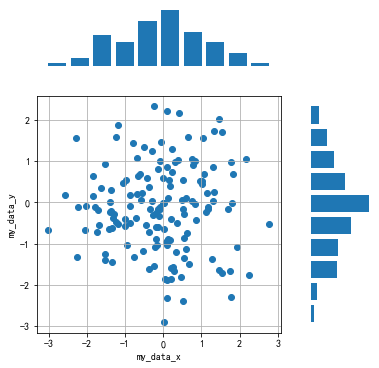


法2：跨行跨列


```python
fig = plt.figure(figsize=(7, 7))
spec = fig.add_gridspec(nrows=5, ncols=5, width_ratios=[1,1,1,1,1], height_ratios=[1,1,1,1,1])

# 散点图
ax1 = fig.add_subplot(spec[1:, 0:-1])
ax1.scatter(df[0,:], df[1,:])
ax1.grid(True)
ax1.set_xlabel('my_data_x')
ax1.set_ylabel('my_data_y')

# 边际分布图
ax = [fig.add_subplot(spec[0, :-1]), fig.add_subplot(spec[1:,-1])]

for i in range(2):
    if i == 0:
        ax[i].hist(df[i,:],rwidth = 0.8, density = True)
    else:
        ax[i].hist(df[i,:],rwidth = 0.8, orientation = 'horizontal', density = True)
    # 背景调整为透明
    ax[i].patch.set_alpha(0) 
    # 去掉刻度
    ax[i].set_xticks([])
    ax[i].set_yticks([])
    # 去掉边框
    ax[i].spines['top'].set_visible(False)
    ax[i].spines['bottom'].set_visible(False)
    ax[i].spines['left'].set_visible(False)
    ax[i].spines['right'].set_visible(False)


```


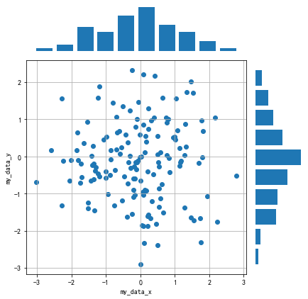


```python

```
