# 第二回：艺术画笔见乾坤

## 一、概述

### 1. matplotlib的三层api
matplotlib的原理或者说基础逻辑是，用Artist对象在画布(canvas)上绘制(Render)图形。  
就和人作画的步骤类似：  
1. 准备一块画布或画纸
2. 准备好颜料、画笔等制图工具
3. 作画
    
所以matplotlib有三个层次的API：  
  
`matplotlib.backend_bases.FigureCanvas` 代表了绘图区，所有的图像都是在绘图区完成的  
`matplotlib.backend_bases.Renderer` 代表了渲染器，可以近似理解为画笔，控制如何在 FigureCanvas 上画图。  
`matplotlib.artist.Artist` 代表了具体的图表组件，即调用了Renderer的接口在Canvas上作图。  
前两者处理程序和计算机的底层交互的事项，第三项Artist就是具体的调用接口来做出我们想要的图，比如图形、文本、线条的设定。所以通常来说，我们95%的时间，都是用来和matplotlib.artist.Artist类打交道的。

### 2. Artist的分类
Artist有两种类型：`primitives` 和`containers`。   
`primitive`是基本要素，它包含一些我们要在绘图区作图用到的标准图形对象，如**曲线Line2D，文字text，矩形Rectangle，图像image**等。  
`container`是容器，即用来装基本要素的地方，包括**图形figure、坐标系Axes和坐标轴Axis**。他们之间的关系如下图所示：  
  


### 3. matplotlib标准用法
matplotlib的标准使用流程为：  
1. 创建一个`Figure`实例
2. 使用`Figure`实例创建一个或者多个`Axes`或`Subplot`实例
3. 使用`Axes`实例的辅助方法来创建`primitive`  

值得一提的是，Axes是一种容器，它可能是matplotlib API中最重要的类，并且我们大多数时间都花在和它打交道上。更具体的信息会在之后容器小节说明。

一个流程示例及说明如下：  


```python
import matplotlib.pyplot as plt
import numpy as np

# step 1 
# 我们用 matplotlib.pyplot.figure() 创建了一个Figure实例
fig = plt.figure()

# step 2
# 然后用Figure实例创建了一个两行一列(即可以有两个subplot)的绘图区，并同时在第一个位置创建了一个subplot
ax = fig.add_subplot(2, 1, 1) # two rows, one column, first plot

# step 3
# 然后用Axes实例的方法画了一条曲线
t = np.arange(0.0, 1.0, 0.01)
s = np.sin(2*np.pi*t)
line, = ax.plot(t, s, color='blue', lw=2)
```


/output_4_0.png)


## 二、自定义你的Artist对象

### 1. Artist属性
在图形中的每一个元素都对应着一个matplotlib `Artist`，且都有其对应的配置属性列表。  
  
`Figure`本身包含一个Rectangle，Rectangle的大小就是Figure的大小；你可以用来设置Figure的背景色和透明度。  
每个`Axes`边界框(默认白底黑边)，也有一个Rectangle，通过它可以设置Axes的颜色、透明度等。  
这些实例都存储在成员变量(member variables) `Figure.patch` 和 `Axes.patch`中。 （*Patch*是一个来源于MATLAB的名词，它是图形上颜色的一个2D*补丁*，包含**rectangels-矩形**，**circles-圆** 和 **plygons-多边形**）
  
换个表达方式：  
Figure.patch属性：是一个Rectangle，代表了图表的矩形框，它的大小就是图表的大小， 并且可以通过它设置figure的背景色和透明度。  
Axes.patch属性：也是一个Rectangle，代表了绘图坐标轴内部的矩形框（白底黑边）， 通过它可以设置Axes的颜色、透明度等。  


每个matplotlib `Artist`都有以下属性：
+ `.alpha`属性：透明度。值为0—1之间的浮点数
+ `.axes`属性：返回这个Artist所属的axes，可能为None
+ `.figure`属性：该Artist所属的Figure，可能为None
+ `.label`：一个text label
+ `.visible`：布尔值，控制Artist是否绘制
  
这里仅列举几个常见的属性，更详细的属性清单请查阅官方文档： [Artist属性列表](https://matplotlib.org/tutorials/intermediate/artists.html#customizing-your-objects)


```python
# .patch
plt.figure().patch
plt.axes().patch
```


    <matplotlib.patches.Rectangle at 0x27ee49c4a00>


### 2. 属性调用方式
Artist对象的所有属性都通过相应的 `get_*` 和 `set_*` 函数进行读写。  
例如下面的语句将alpha属性设置为当前值的一半：
```
a = o.get_alpha()
o.set_alpha(0.5*a)
```

如果想一次设置多个属性，也可以用set方法：
```
o.set(alpha=0.5, zorder=2)
```

可以使用 `matplotlib.artist.getp(o,"alpha")` 来获取属性，如果指定属性名，则返回对象的该属性值；如果不指定属性名，则返回对象的所有的属性和值。


```python
import matplotlib
# Figure rectangle的属性
matplotlib.artist.getp(fig.patch)
```

        agg_filter = None
        alpha = None
        animated = False
        antialiased or aa = False
        bbox = Bbox(x0=0.0, y0=0.0, x1=1.0, y1=1.0)
        capstyle = butt
        children = []
        clip_box = None
        clip_on = True
        clip_path = None
        contains = None
        data_transform = BboxTransformTo(     TransformedBbox(         Bbox...
        edgecolor or ec = (1.0, 1.0, 1.0, 0.0)
        extents = Bbox(x0=0.0, y0=0.0, x1=432.0, y1=288.0)
        facecolor or fc = (1.0, 1.0, 1.0, 0.0)
        figure = Figure(432x288)
        fill = True
        gid = None
        hatch = None
        height = 1
        in_layout = False
        joinstyle = miter
        label = 
        linestyle or ls = solid
        linewidth or lw = 0.0
        patch_transform = CompositeGenericTransform(     BboxTransformTo(   ...
        path = Path(array([[0., 0.],        [1., 0.],        [1.,...
        path_effects = []
        picker = None
        rasterized = None
        sketch_params = None
        snap = None
        transform = CompositeGenericTransform(     CompositeGenericTra...
        transformed_clip_path_and_affine = (None, None)
        url = None
        verts = [[  0.   0.]  [432.   0.]  [432. 288.]  [  0. 288....
        visible = True
        width = 1
        window_extent = Bbox(x0=0.0, y0=0.0, x1=432.0, y1=288.0)
        x = 0
        xy = (0, 0)
        y = 0
        zorder = 1
    

## 三、基本元素 - primitives
现在我们知道了如何检查和设置给定对象的属性，我们还需要知道如何获取该对象。  
  
前文介绍到，`Artist`包含两种对象：`基本要素-primitives` 和 `容器-containers`。  
`primitives`是基本要素，它包含一些我们要在绘图区作图用到的标准图形对象，如**曲线Line2D，文本text，矩形Rectangle，图像image**等。  
`container`是容器，即用来装基本要素的地方，包括**图形figure、坐标系Axes和坐标轴Axis**。    
  
本章重点介绍下 `primitives` 的几种类型：**曲线-Line2D，矩形-Rectangle，图像-image** （其中文本-Text较为复杂，会在之后单独详细说明。）


### 1. 2DLines
在matplotlib中曲线的绘制，主要是通过类 `matplotlib.lines.Line2D` 来完成的。   
它的基类: `matplotlib.artist.Artist`   
  
matplotlib中`线-line`的含义：它表示的可以是连接所有顶点的实线样式，也可以是每个顶点的标记。此外，这条线也会受到绘画风格的影响，比如，我们可以创建虚线种类的线。

它的构造函数：

>```
class matplotlib.lines.Line2D(xdata, ydata, linewidth=None, linestyle=None, color=None, marker=None, markersize=None, markeredgewidth=None, markeredgecolor=None, markerfacecolor=None, markerfacecoloralt='none', fillstyle=None, antialiased=None, dash_capstyle=None, solid_capstyle=None, dash_joinstyle=None, solid_joinstyle=None, pickradius=5, drawstyle=None, markevery=None, **kwargs)
>```


其中常用的的参数有：  
+ **xdata**:需要绘制的line中点的在x轴上的取值，若忽略，则默认为range(1,len(ydata)+1)
+ **ydata**:需要绘制的line中点的在y轴上的取值
+ **linewidth**:线条的宽度
+ **linestyle**:线型
+ **color**:线条的颜色
+ **marker**:点的标记，详细可参考[markers API](https://matplotlib.org/api/markers_api.html#module-matplotlib.markers)
+ **markersize**:标记的size
  
其他详细参数可参考[Line2D官方文档](https://matplotlib.org/api/_as_gen/matplotlib.lines.Line2D.html#examples-using-matplotlib-lines-line2d)

#### a. 如何设置Line2D的属性
有三种方法可以用设置线的属性。  
  
1) **直接在plot()函数中设置**


```python
import matplotlib.pyplot as plt
x = range(0,5)
y = [2,5,7,8,10]
plt.plot(x,y, linewidth=10) # 设置线的粗细参数为10
```


    [<matplotlib.lines.Line2D at 0x2b153213548>]


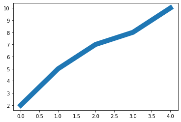


2) **通过获得线对象，对线对象进行设置**


```python
x = range(0,5)
y = [2,5,7,8,10]
line, = plt.plot(x, y, '-')
line.set_antialiased(False) # 关闭抗锯齿功能
```


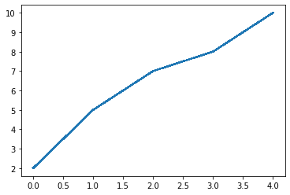


3) **获得线属性，使用setp()函数设置**


```python
x = range(0,5)
y = [2,5,7,8,10]
lines = plt.plot(x, y)
plt.setp(lines, color='r', linewidth=10)
```


    [None, None]


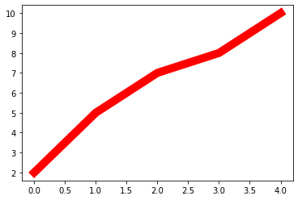


#### b. 如何绘制lines
**1) 绘制直线line**
常用的方法有两种
+ **pyplot方法绘制**  
+ **Line2D对象绘制**  


1. pyplot方法绘制


```python
import matplotlib.pyplot as plt
x = range(0,5)
y = [2,5,7,8,10]
plt.plot(x,y)
```


    [<matplotlib.lines.Line2D at 0x2b153387f08>]


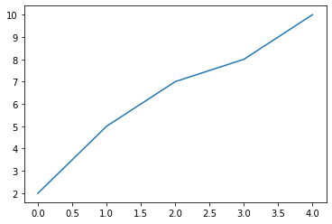


2. Line2D对象绘制


```python
import matplotlib.pyplot as plt
from matplotlib.lines import Line2D      

fig = plt.figure()
ax = fig.add_subplot(111)
line = Line2D(x, y)
ax.add_line(line)
ax.set_xlim(min(x), max(x))
ax.set_ylim(min(y), max(y))

plt.show()
```


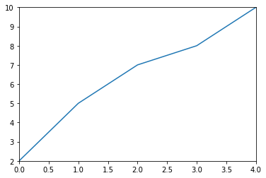


**2) errorbar绘制误差折线图**  
pyplot里有个专门绘制误差线的功能，通过`errorbar`类实现，它的构造函数： 
  
>matplotlib.pyplot.errorbar(x, y, yerr=None, xerr=None, fmt='', ecolor=None, elinewidth=None, capsize=None, barsabove=False, lolims=False, uplims=False, xlolims=False, xuplims=False, errorevery=1, capthick=None, \*, data=None, \**kwargs)
  
其中最主要的参数是前几个:  
+ **x**：需要绘制的line中点的在x轴上的取值  
+ **y**：需要绘制的line中点的在y轴上的取值  
+ **yerr**：指定y轴水平的误差  
+ **xerr**：指定x轴水平的误差   
+ **fmt**：指定折线图中某个点的颜色，形状，线条风格，例如‘co--’  
+ **ecolor**：指定error bar的颜色  
+ **elinewidth**：指定error bar的线条宽度  


绘制errorbar


```python
import numpy as np
import matplotlib.pyplot as plt
fig = plt.figure()
x = np.arange(10)
y = 2.5 * np.sin(x / 20 * np.pi)
yerr = np.linspace(0.05, 0.2, 10)
plt.errorbar(x, y + 3, yerr=yerr, label='both limits (default)')

```


    <ErrorbarContainer object of 3 artists>


### 2. patches
matplotlib.patches.Patch类是二维图形类。它的基类是matplotlib.artist.Artist，它的构造函数：  
详细清单见 [matplotlib.patches API](https://matplotlib.org/api/patches_api.html)  
  
  

>Patch(edgecolor=None, facecolor=None, color=None,
  linewidth=None, linestyle=None, antialiased=None,
  hatch=None, fill=True, capstyle=None, joinstyle=None,
  **kwargs)
  

#### a. Rectangle-矩形
`Rectangle`矩形类在官网中的定义是： 通过锚点xy及其宽度和高度生成。
Rectangle本身的主要比较简单，即xy控制锚点，width和height分别控制宽和高。它的构造函数：

> class matplotlib.patches.Rectangle(xy, width, height, angle=0.0, **kwargs)

在实际中最常见的矩形图是hist直方图和bar条形图。  
  
  

**1) hist-直方图**  

>matplotlib.pyplot.hist(x,bins=None,range=None, density=None, bottom=None, histtype='bar', align='mid', log=False, color=None, label=None, stacked=False, normed=None)
    
下面是一些常用的参数：  
+ **x**: 数据集，最终的直方图将对数据集进行统计
+ **bins**: 统计的区间分布
+ **range**: tuple, 显示的区间，range在没有给出bins时生效
+ **density**: bool，默认为false，显示的是频数统计结果，为True则显示频率统计结果，这里需要注意，频率统计结果=区间数目/(总数*区间宽度)，和normed效果一致，官方推荐使用density
+ **histtype**: 可选{'bar', 'barstacked', 'step', 'stepfilled'}之一，默认为bar，推荐使用默认配置，step使用的是梯状，stepfilled则会对梯状内部进行填充，效果与bar类似
+ **align**: 可选{'left', 'mid', 'right'}之一，默认为'mid'，控制柱状图的水平分布，left或者right，会有部分空白区域，推荐使用默认
+ **log**: bool，默认False,即y坐标轴是否选择指数刻度
+ **stacked**: bool，默认为False，是否为堆积状图

hist绘制直方图


```python
import matplotlib.pyplot as plt
import numpy as np 
x=np.random.randint(0,100,100) #生成【0-100】之间的100个数据,即 数据集 
bins=np.arange(0,101,10) #设置连续的边界值，即直方图的分布区间[0,10],[10,20]... 
plt.hist(x,bins,color='fuchsia',alpha=0.5)#alpha设置透明度，0为完全透明 
plt.xlabel('scores') 
plt.ylabel('count') 
plt.xlim(0,100)#设置x轴分布范围 plt.show()
```


    (0.0, 100.0)


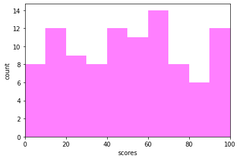


`Rectangle`矩形类绘制直方图


```python
import pandas as pd
import re
df = pd.DataFrame(columns = ['data'])
df.loc[:,'data'] = x
df['fenzu'] = pd.cut(df['data'], bins=bins, right = False,include_lowest=True)

df_cnt = df['fenzu'].value_counts().reset_index()
df_cnt.loc[:,'mini'] = df_cnt['index'].astype(str).map(lambda x:re.findall('\[(.*)\,',x)[0]).astype(int)
df_cnt.loc[:,'maxi'] = df_cnt['index'].astype(str).map(lambda x:re.findall('\,(.*)\)',x)[0]).astype(int)
df_cnt.loc[:,'width'] = df_cnt['maxi']- df_cnt['mini']
df_cnt.sort_values('mini',ascending = True,inplace = True)
df_cnt.reset_index(inplace = True,drop = True)

#用Rectangle把hist绘制出来
import matplotlib.pyplot as plt

fig = plt.figure()
ax1 = fig.add_subplot(111)
#rect1 = plt.Rectangle((0,0),10,10)
#ax1.add_patch(rect)

#ax2 = fig.add_subplot(212)
for i in df_cnt.index:
    rect =  plt.Rectangle((df_cnt.loc[i,'mini'],0),df_cnt.loc[i,'width'],df_cnt.loc[i,'fenzu'])
#rect2 = plt.Rectangle((10,0),10,5)
    ax1.add_patch(rect)
#ax1.add_patch(rect2)
ax1.set_xlim(0, 100)
ax1.set_ylim(0, 16)
plt.show()
```


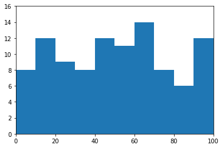


**2) bar-柱状图**   
  
>matplotlib.pyplot.bar(left, height, alpha=1, width=0.8, color=, edgecolor=, label=, lw=3)
  
下面是一些常用的参数：    
+ **left**：x轴的位置序列，一般采用range函数产生一个序列，但是有时候可以是字符串  
+ **height**：y轴的数值序列，也就是柱形图的高度，一般就是我们需要展示的数据；  
+ **alpha**：透明度，值越小越透明  
+ **width**：为柱形图的宽度，一般这是为0.8即可；  
+ **color或facecolor**：柱形图填充的颜色；  
+ **edgecolor**：图形边缘颜色   
+ **label**：解释每个图像代表的含义，这个参数是为legend()函数做铺垫的，表示该次bar的标签    

bar绘制柱状图


```python
import matplotlib as mpl
y = range(1,17)
plt.bar(np.arange(16), y, alpha=0.5, width=0.5, color='yellow', edgecolor='red', label='The First Bar', lw=3)
```


    <BarContainer object of 16 artists>


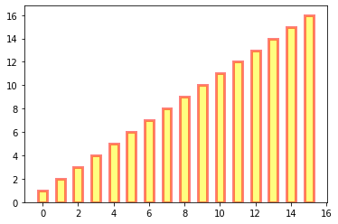


`Rectangle`矩形类绘制柱状图


```python
#import matplotlib.pyplot as plt
fig = plt.figure()
ax1 = fig.add_subplot(111)

for i in range(1,17):
    rect =  plt.Rectangle((i+0.25,0),0.5,i)
    ax1.add_patch(rect)
ax1.set_xlim(0, 16)
ax1.set_ylim(0, 16)
plt.show()
```


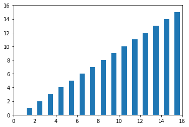


#### b. Polygon-多边形
matplotlib.patches.Polygon类是多边形类。其基类是matplotlib.patches.Patch，它的构造函数：
  
>class matplotlib.patches.Polygon(xy, closed=True, **kwargs)  
  
xy是一个N×2的numpy array，为多边形的顶点。  
closed为True则指定多边形将起点和终点重合从而显式关闭多边形。  


matplotlib.patches.Polygon类中常用的是fill类，它是基于xy绘制一个填充的多边形，它的定义：

>matplotlib.pyplot.fill(*args, data=None, **kwargs)

参数说明 : 关于x、y和color的序列，其中color是可选的参数，每个多边形都是由其节点的x和y位置列表定义的，后面可以选择一个颜色说明符。您可以通过提供多个x、y、[颜色]组来绘制多个多边形。

fill绘制图形


```python
import matplotlib.pyplot as plt
x = np.linspace(0, 5 * np.pi, 1000) 
y1 = np.sin(x)
y2 = np.sin(2 * x) 
plt.fill(x, y1, color = "g", alpha = 0.3)
```


    [<matplotlib.patches.Polygon at 0x2b1541ce088>]


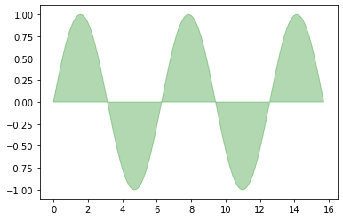


#### c. Wedge-契形
matplotlib.patches.Polygon类是多边形类。其基类是matplotlib.patches.Patch，它的构造函数：

>class matplotlib.patches.Wedge(center, r, theta1, theta2, width=None, **kwargs)  
  
一个Wedge-契形 是以坐标x,y为中心，半径为r，从θ1扫到θ2(单位是度)。  
如果宽度给定，则从内半径r -宽度到外半径r画出部分楔形。wedge中比较常见的是绘制饼状图。  
  

matplotlib.pyplot.pie语法：  
>matplotlib.pyplot.pie(x, explode=None, labels=None, colors=None, autopct=None, pctdistance=0.6, shadow=False, labeldistance=1.1, startangle=0, radius=1, counterclock=True, wedgeprops=None, textprops=None, center=0, 0, frame=False, rotatelabels=False, *, normalize=None, data=None)
  
制作数据x的饼图，每个楔子的面积用x/sum(x)表示。    
其中最主要的参数是前4个：  
+ **x**：契型的形状，一维数组。
+ **explode**：如果不是等于None，则是一个len(x)数组，它指定用于偏移每个楔形块的半径的分数。  
+ **labels**：用于指定每个契型块的标记，取值是列表或为None。  
+ **colors**：饼图循环使用的颜色序列。如果取值为None，将使用当前活动循环中的颜色。  
+ **startangle**：饼状图开始的绘制的角度。   

pie绘制饼状图


```python
import matplotlib.pyplot as plt 
labels = 'Frogs', 'Hogs', 'Dogs', 'Logs'
sizes = [15, 30, 45, 10] 
explode = (0, 0.1, 0, 0) 
fig1, ax1 = plt.subplots() 
ax1.pie(sizes, explode=explode, labels=labels, autopct='%1.1f%%', shadow=True, startangle=90) 
ax1.axis('equal') # Equal aspect ratio ensures that pie is drawn as a circle. 
plt.show()
```


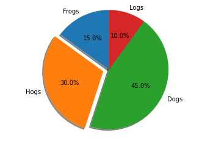


wedge绘制饼图


```python
import matplotlib.pyplot as plt 
from matplotlib.patches import Circle, Wedge
from matplotlib.collections import PatchCollection

fig = plt.figure()
ax1 = fig.add_subplot(111)
theta1 = 0
sizes = [15, 30, 45, 10] 
patches = []
patches += [
    Wedge((0.3, 0.3), .2, 0, 54),             # Full circle
    Wedge((0.3, 0.3), .2, 54, 162),  # Full ring
    Wedge((0.3, 0.3), .2, 162, 324),              # Full sector
    Wedge((0.3, 0.3), .2, 324, 360),  # Ring sector
]
colors = 100 * np.random.rand(len(patches))
p = PatchCollection(patches, alpha=0.4)
p.set_array(colors)
ax1.add_collection(p)
plt.show()
```


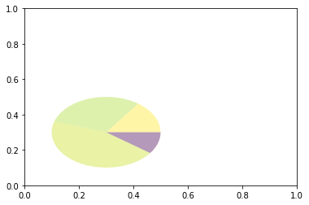


### 3. collections
collections类是用来绘制一组对象的集合，collections有许多不同的子类，如RegularPolyCollection, CircleCollection, Pathcollection, 分别对应不同的集合子类型。其中比较常用的就是散点图，它是属于PathCollection子类，scatter方法提供了该类的封装，根据x与y绘制不同大小或颜色标记的散点图。 它的构造方法：
  
>Axes.scatter(self, x, y, s=None, c=None, marker=None, cmap=None, norm=None, vmin=None, vmax=None, alpha=None, linewidths=None, verts=<deprecated parameter>, edgecolors=None, *, plotnonfinite=False, data=None, **kwargs)
      
      
其中最主要的参数是前5个：  
+ **x**：数据点x轴的位置  
+ **y**：数据点y轴的位置  
+ **s**：尺寸大小  
+ **c**：可以是单个颜色格式的字符串，也可以是一系列颜色  
+ **marker**: 标记的类型  


scatter绘制散点图


```python
x = [0,2,4,6,8,10] 
y = [10]*len(x) 
s = [20*2**n for n in range(len(x))] 
plt.scatter(x,y,s=s) 
plt.show()
```


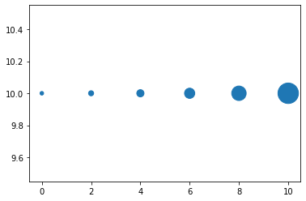


### 4. images
images是matplotlib中绘制image图像的类，其中最常用的imshow可以根据数组绘制成图像，它的构造函数：
>class matplotlib.image.AxesImage(ax, cmap=None, norm=None, interpolation=None, origin=None, extent=None, filternorm=True, filterrad=4.0, resample=False, **kwargs)
  
imshow根据数组绘制图像
>matplotlib.pyplot.imshow(X, cmap=None, norm=None, aspect=None, interpolation=None, alpha=None, vmin=None, vmax=None, origin=None, extent=None, shape=<deprecated parameter>, filternorm=1, filterrad=4.0, imlim=<deprecated parameter>, resample=None, url=None, *, data=None, **kwargs）

使用imshow画图时首先需要传入一个数组，数组对应的是空间内的像素位置和像素点的值，interpolation参数可以设置不同的差值方法，具体效果如下。


```python
import matplotlib.pyplot as plt
import numpy as np
methods = [None, 'none', 'nearest', 'bilinear', 'bicubic', 'spline16',
           'spline36', 'hanning', 'hamming', 'hermite', 'kaiser', 'quadric',
           'catrom', 'gaussian', 'bessel', 'mitchell', 'sinc', 'lanczos']


grid = np.random.rand(4, 4)

fig, axs = plt.subplots(nrows=3, ncols=6, figsize=(9, 6),
                        subplot_kw={'xticks': [], 'yticks': []})

for ax, interp_method in zip(axs.flat, methods):
    ax.imshow(grid, interpolation=interp_method, cmap='viridis')
    ax.set_title(str(interp_method))

plt.tight_layout()
plt.show()
```


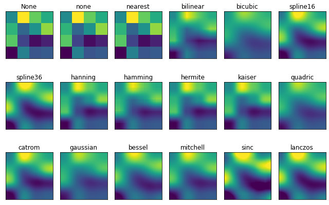


## 四、对象容器 - Object container
容器会包含一些`primitives`，并且容器还有它自身的属性。  
比如`Axes Artist`，它是一种容器，它包含了很多`primitives`，比如`Line2D`，`Text`；同时，它也有自身的属性，比如`xscal`，用来控制X轴是`linear`还是`log`的。  

### 1. Figure容器
`matplotlib.figure.Figure`是`Artist`最顶层的`container`-对象容器，它包含了图表中的所有元素。一张图表的背景就是在`Figure.patch`的一个矩形`Rectangle`。  
当我们向图表添加`Figure.add_subplot()`或者`Figure.add_axes()`元素时，这些都会被添加到`Figure.axes`列表中。


```python
fig = plt.figure()
ax1 = fig.add_subplot(211) # 作一幅2*1的图，选择第1个子图
ax2 = fig.add_axes([0.1, 0.1, 0.7, 0.3]) # 位置参数，四个数分别代表了(left,bottom,width,height)
# print(ax1) 
print(fig.axes) # fig.axes 中包含了subplot和axes两个实例, 刚刚添加的
```

    [<matplotlib.axes._subplots.AxesSubplot object at 0x0000027EE4BE0A30>, <matplotlib.axes._axes.Axes object at 0x0000027EE4BE5DF0>]
    


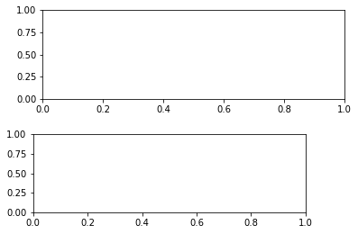


由于`Figure`维持了`current axes`，因此你不应该手动的从`Figure.axes`列表中添加删除元素，而是要通过`Figure.add_subplot()`、`Figure.add_axes()`来添加元素，通过`Figure.delaxes()`来删除元素。但是你可以迭代或者访问`Figure.axes`中的`Axes`，然后修改这个`Axes`的属性。   
  
比如下面的遍历axes里的内容，并且添加网格线：


```python
fig = plt.figure()
ax1 = fig.add_subplot(211)

for ax in fig.axes:
    ax.grid(True)
    

```


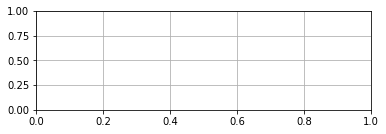


`Figure`也有它自己的`text、line、patch、image`。你可以直接通过`add primitive`语句直接添加。但是注意`Figure`默认的坐标系是以像素为单位，你可能需要转换成figure坐标系：(0,0)表示左下点，(1,1)表示右上点。

**Figure容器的常见属性：**  
`Figure.patch`属性：Figure的背景矩形  
`Figure.axes`属性：一个Axes实例的列表（包括Subplot)  
`Figure.images`属性：一个FigureImages patch列表  
`Figure.lines`属性：一个Line2D实例的列表（很少使用）  
`Figure.legends`属性：一个Figure Legend实例列表（不同于Axes.legends)  
`Figure.texts`属性：一个Figure Text实例列表  

### 2. Axes容器

`matplotlib.axes.Axes`是matplotlib的核心。大量的用于绘图的`Artist`存放在它内部，并且它有许多辅助方法来创建和添加`Artist`给它自己，而且它也有许多赋值方法来访问和修改这些`Artist`。  
  
和`Figure`容器类似，`Axes`包含了一个patch属性，对于笛卡尔坐标系而言，它是一个`Rectangle`；对于极坐标而言，它是一个`Circle`。这个patch属性决定了绘图区域的形状、背景和边框。


```python
import numpy as np
import matplotlib.pyplot as plt
import matplotlib

fig = plt.figure()
ax = fig.add_subplot(111)
rect = ax.patch  # axes的patch是一个Rectangle实例
rect.set_facecolor('green')
```


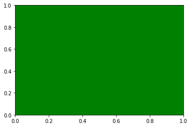


`Axes`有许多方法用于绘图，如`.plot()、.text()、.hist()、.imshow()`等方法用于创建大多数常见的`primitive`(如`Line2D，Rectangle，Text，Image`等等）。在`primitives`中已经涉及，不再赘述。   
  
Subplot就是一个特殊的Axes，其实例是位于网格中某个区域的Subplot实例。其实你也可以在任意区域创建Axes，通过Figure.add_axes([left,bottom,width,height])来创建一个任意区域的Axes，其中left,bottom,width,height都是[0—1]之间的浮点数，他们代表了相对于Figure的坐标。

你不应该直接通过`Axes.lines`和`Axes.patches`列表来添加图表。因为当创建或添加一个对象到图表中时，`Axes`会做许多自动化的工作:  
它会设置Artist中figure和axes的属性，同时默认Axes的转换；  
它也会检视Artist中的数据，来更新数据结构，这样数据范围和呈现方式可以根据作图范围自动调整。  
  
你也可以使用Axes的辅助方法`.add_line()`和`.add_patch()`方法来直接添加。  

另外Axes还包含两个最重要的Artist container：

`ax.xaxis`：XAxis对象的实例，用于处理x轴tick以及label的绘制  
`ax.yaxis`：YAxis对象的实例，用于处理y轴tick以及label的绘制  
会在下面章节详细说明。

**Axes容器**的常见属性有：  
`artists`:    Artist实例列表
`patch`:     Axes所在的矩形实例
`collections`: Collection实例
`images`:    Axes图像
`legends`:	  Legend 实例
`lines`:	  Line2D 实例
`patches`:	  Patch 实例
`texts`:	  Text 实例
`xaxis`:	  matplotlib.axis.XAxis 实例
`yaxis`:	  matplotlib.axis.YAxis 实例

### 3. Axis容器

`matplotlib.axis.Axis`实例处理`tick line`、`grid line`、`tick label`以及`axis label`的绘制，它包括坐标轴上的刻度线、刻度`label`、坐标网格、坐标轴标题。通常你可以独立的配置y轴的左边刻度以及右边的刻度，也可以独立地配置x轴的上边刻度以及下边的刻度。

刻度包括主刻度和次刻度，它们都是Tick刻度对象。  
  
`Axis`也存储了用于自适应，平移以及缩放的`data_interval`和`view_interval`。它还有Locator实例和Formatter实例用于控制刻度线的位置以及刻度label。

每个Axis都有一个`label`属性，也有主刻度列表和次刻度列表。这些`ticks`是`axis.XTick`和`axis.YTick`实例，它们包含着`line primitive`以及`text primitive`用来渲染刻度线以及刻度文本。

刻度是动态创建的，只有在需要创建的时候才创建（比如缩放的时候）。Axis也提供了一些辅助方法来获取刻度文本、刻度线位置等等：  
常见的如下：


```python
# 不用print，直接显示结果
from IPython.core.interactiveshell import InteractiveShell
InteractiveShell.ast_node_interactivity = "all"

fig, ax = plt.subplots()
x = range(0,5)
y = [2,5,7,8,10]
plt.plot(x, y, '-')

axis = ax.xaxis # axis为X轴对象
axis.get_ticklocs()     # 获取刻度线位置
axis.get_ticklabels()   # 获取刻度label列表(一个Text实例的列表）。 可以通过minor=True|False关键字参数控制输出minor还是major的tick label。
axis.get_ticklines()    # 获取刻度线列表(一个Line2D实例的列表）。 可以通过minor=True|False关键字参数控制输出minor还是major的tick line。
axis.get_data_interval()# 获取轴刻度间隔
axis.get_view_interval()# 获取轴视角（位置）的间隔
```


    array([-0.2,  4.2])


下面的例子展示了如何调整一些轴和刻度的属性(忽略美观度，仅作调整参考)：  


```python
fig = plt.figure() # 创建一个新图表
rect = fig.patch   # 矩形实例并将其设为黄色
rect.set_facecolor('lightgoldenrodyellow')

ax1 = fig.add_axes([0.1, 0.3, 0.4, 0.4]) # 创一个axes对象，从(0.1,0.3)的位置开始，宽和高都为0.4，
rect = ax1.patch   # ax1的矩形设为灰色
rect.set_facecolor('lightslategray')


for label in ax1.xaxis.get_ticklabels(): 
    # 调用x轴刻度标签实例，是一个text实例
    label.set_color('red') # 颜色
    label.set_rotation(45) # 旋转角度
    label.set_fontsize(16) # 字体大小

for line in ax1.yaxis.get_ticklines():
    # 调用y轴刻度线条实例, 是一个Line2D实例
    line.set_color('green')    # 颜色
    line.set_markersize(25)    # marker大小
    line.set_markeredgewidth(2)# marker粗细

plt.show()
```


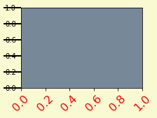


### 4. Tick容器

`matplotlib.axis.Tick`是从`Figure`到`Axes`到`Axis`到`Tick`中最末端的容器对象。  
`Tick`包含了`tick`、`grid line`实例以及对应的`label`。 
  
所有的这些都可以通过`Tick`的属性获取，常见的`tick`属性有     
`Tick.tick1line`：Line2D实例  
`Tick.tick2line`：Line2D实例  
`Tick.gridline`：Line2D实例  
`Tick.label1`：Text实例  
`Tick.label2`：Text实例  
  
y轴分为左右两个，因此tick1对应左侧的轴；tick2对应右侧的轴。   
x轴分为上下两个，因此tick1对应下侧的轴；tick2对应上侧的轴。  

下面的例子展示了，如何将Y轴右边轴设为主轴，并将标签设置为美元符号且为绿色：


```python
import numpy as np
import matplotlib.pyplot as plt
import matplotlib

fig, ax = plt.subplots()
ax.plot(100*np.random.rand(20))

# 设置ticker的显示格式
formatter = matplotlib.ticker.FormatStrFormatter('$%1.2f')
ax.yaxis.set_major_formatter(formatter)

# 设置ticker的参数，右侧为主轴，颜色为绿色
ax.yaxis.set_tick_params(which='major', labelcolor='green',
                         labelleft=False, labelright=True)

plt.show()
```


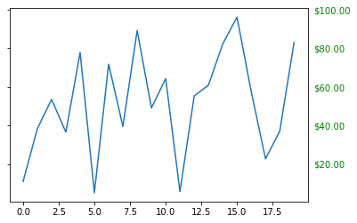


## 思考题
1. primitives 和 container的区别和联系是什么？
2. 四个容器的联系和区别是么？他们分别控制一张图表的哪些要素？

1.

    container为容器 包括figure，axes，axis， tick四种容器，
    而primitives为基本元素，包括line，text, rectangle, image等,放在容器中

2.

    四个容器 像俄罗斯套娃一个套一个，figure在最外层，往里依次是axes,axis,tick，
    他们分别控制图标的背景（可以看成拿到手中的一张白纸）， 绘制的图表，坐标轴，刻度
    

## 绘图题

1. 教程中展示的案例都是单一图，请自行创建数据，**画出包含6个子图的线图**，要求：    
子图排布是 2 * 3 （2行 3列）；  
线图可用教程中line2D方法绘制；  
需要设置每个子图的横坐标和纵坐标刻度；
并设置整个图的标题，横坐标名称，以及纵坐标名称
2. 分别用一组长方形柱和填充面积的方式模仿画出下图，函数 y = -1 * (x - 2) * (x - 8) +10 在区间[2,9]的积分面积


T 1


```python
import numpy as np
import matplotlib.pyplot as plt
from matplotlib.lines import Line2D 
from matplotlib.pyplot import MultipleLocator

fig, axes = plt.subplots(2, 3, figsize=(9, 6))
x = np.arange(0, 5)
for ax in axes.flat:
    y = np.random.randint(1, 10, size = 5)
    line = Line2D(x, y)
    ax.add_line(line)
    ax.set_xlim(0, max(x))
    ax.set_ylim(0, 10)
    x_major_locator = MultipleLocator(1)
    y_major_locator = MultipleLocator(5)
    ax.xaxis.set_major_locator(x_major_locator)
    ax.yaxis.set_major_locator(y_major_locator)
    ax.set_xlabel('x')
    ax.set_ylabel('y')

fig.suptitle('Text', fontsize = 30)
```


    Text(0.5, 0.98, 'Text')


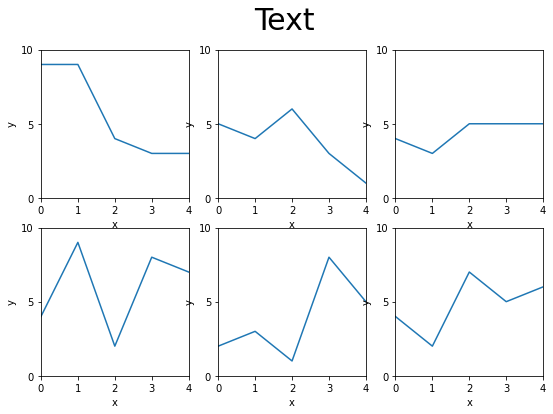


T 2


```python
fig = plt.figure()
ax1 = fig.add_subplot(111)

x = np.linspace(0, 10, 1000)
y = -1*(x-2)*(x-8)+10
plt.plot(x, y, 'r')
for i in np.linspace(2,9, 40):
    rect =  plt.Rectangle((i,0),0.1, -1*(i-2)*(i-8)+10, color = 'grey', alpha = 0.4)
    ax1.add_patch(rect)
ax1.set_xlim(0, 10)
ax1.set_ylim(0, 20)
plt.show()
```


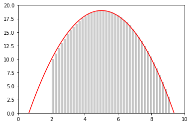


```python
fig = plt.figure()
ax1 = fig.add_subplot(111)

x = np.linspace(0, 10, 1000)
y = -1*(x-2)*(x-8)+10
plt.plot(x, y, 'r')

x2 = np.linspace(2, 9, 700)
y2 = -1*(x2-2)*(x2-8)+10
x3 = np.array([2]+list(x2)+[9])
y3 = np.array([0]+list(y2)+[0])
plt.fill(x3, y3, color = 'grey', alpha = 0.4)
ax1.set_xlim(0, 10)
ax1.set_ylim(0, 20)
```


    (0.0, 20.0)


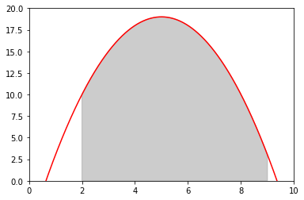


## 参考资料
[1. matplotlib设计的基本逻辑](https://zhuanlan.zhihu.com/p/32693665)  
[2. matplotlib.artist api](https://matplotlib.org/api/artist_api.html)  
[3. matplotlib官方教程](https://matplotlib.org/tutorials/intermediate/artists.html#sphx-glr-tutorials-intermediate-artists-py)  
[4. AI算法工程师手册](https://www.bookstack.cn/read/huaxiaozhuan-ai/spilt.2.333f5abdbabf383d.md)  


```python

```
